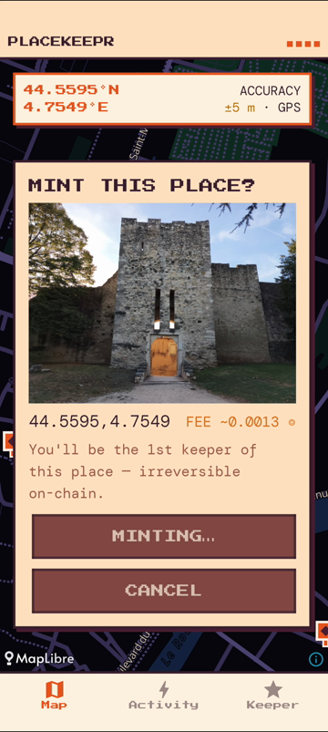
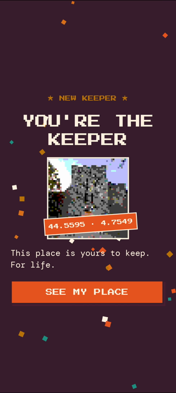
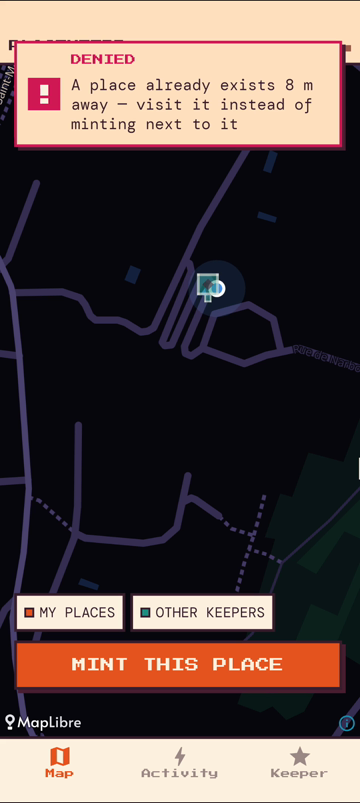
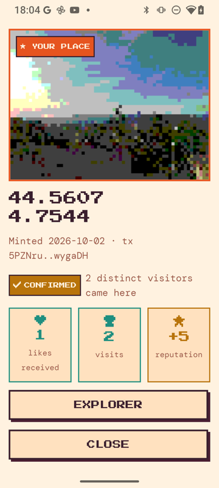
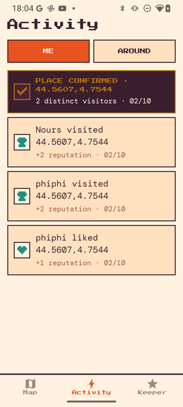
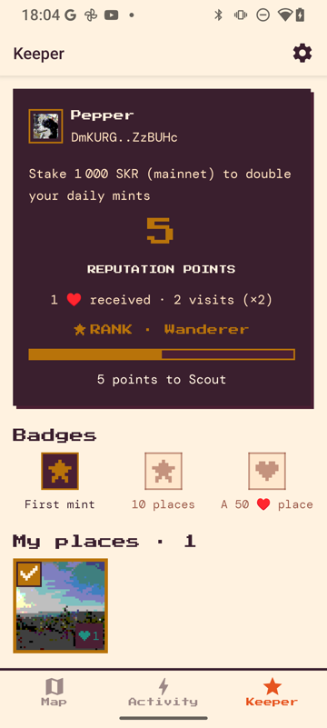

# PlaceKeepr

**Strava for places, on Solana.** Stand somewhere, take a photo, and mint that spot as a
compressed NFT. The first person to capture a place becomes its **keeper**: they earn
reputation when others like it or physically visit it, and a share of its royalties.

Built for the **Solana Seeker** and the Solana dApp Store — React Native + Expo, Mobile
Wallet Adapter, Seed Vault, an Anchor program and Bubblegum cNFTs.

> Submitted to **CLOCK IN**, the Solana Mobile hackathon (Sept–Oct 2026).
> Runs on **devnet**. [Demo video](https://drive.google.com/file/d/1Vyvy8HAQBna-jUPlT9lfVqFofoym_b_G/view) ·
> [Pitch deck](https://drive.google.com/file/d/1lJuf8eeol5DwaFdeqR1cWlghlA7o-Qxt/view) ·
> [APK](https://github.com/philippe-l/placekeepr/releases/download/v1.0.0/placekeepr-1.0.0-devnet.apk)

| Capture | New keeper | Anti-spam | Confirmed place | Activity | Keeper & SKR |
| --- | --- | --- | --- | --- | --- |
|  |  |  |  |  |  |

All screenshots are real, from a Seeker on devnet, with demo accounts.

---

## The loop

1. **Capture.** Tap *Mint this place*. The app takes a fresh GPS fix and a camera-only photo
   (no gallery), then mints a cNFT whose metadata points to the photo. One place per
   ~11 m grid cell, enforced on-chain: first come, first kept.
2. **Keep.** Your places show up on everyone's map. Every **like** is worth 1 reputation
   point and every **verified visit** 2. Reputation moves you through keeper ranks.
3. **Visit.** Visiting someone's place means being physically there (within 50 m), with
   a location check co-signed by the server. Once per 24 h per visitor, and you can't
   visit your own place.
4. **Confirm.** A place with **2 distinct visitors** becomes *confirmed*: proof of interest,
   verified by people who were actually there. When you zoom out, the map only shows
   confirmed places.
5. **Earn.** Each place has an on-chain royalty vault. Distributions split
   **60% keeper / 20% treasury / 20% the 10 most recent likers**, all computed by the
   program and callable by anyone.
6. **Back it with SKR.** Keepers with **≥ 1,000 SKR staked** on mainnet are *SKR-backed*:
   their daily capture limit doubles (10 instead of 5) and they get a badge.

## Why this design

Location apps die from two problems: fake locations and spam. PlaceKeepr puts a check on
the chain at every step where cheating would pay.

| Threat | Defense |
| --- | --- |
| Spoofed GPS | Fresh high-accuracy fix, mock-location rejected, ≤ 25 m accuracy; server-side plausibility (≤ ~900 km/h since your last capture **or** visit). |
| Calling the program directly | `register_place` and `visit_place` **require the verifier's co-signature**. The server signs only after it has inspected the transaction. |
| Abusing that co-signature | The verifier signs a *message*, which authorizes every instruction in it. So the server rejects any message with more than one registry instruction, **derives** the place PDA from the verified coordinates, and refuses any message where the verifier key appears in an instruction it has not inspected. |
| Spam-minting into the official tree | The Merkle tree is **private**, with the verifier as delegate. Every mint must match exactly what the app produces: right tree and owner, the place vault as sole creator, 500 bps, metadata already stored on our server. |
| Carpeting a neighborhood | 5 captures/day per wallet, no capture within 50 m of an existing place (visit it instead). Both are checked under a lock, so concurrent requests can't slip through. |
| Sybil wallets | Staked SKR raises the cap. A stake is locked 48 h before withdrawal, so it can't be recycled across wallets the way a plain balance can. |
| Front-running a distribution | Anyone can call the distribution, but everything comes from the chain: keeper from the `Place` account, treasury from a PDA, likers from the vault's ring buffer. Unliking removes you from the buffer. |

Known limitation (kept for after the hackathon): the likers ring buffer is not
time-weighted, so a burst of fresh likes right before a distribution can capture the
likers' 20%. The fix, a minimum like age, changes the vault layout and is planned
together with confirmation-gated royalties.

### Where each rule lives

| Rule | Code | Tests |
| --- | --- | --- |
| Fresh GPS fix, mock location rejected, ≤ 25 m accuracy | [`app/components/mint/verify-capture.ts`](app/components/mint/verify-capture.ts) | — |
| Travel-speed check against the last capture **or** visit | [`server/src/routes/verify-capture.ts`](server/src/routes/verify-capture.ts), `presence_check` in [`server/db/schema.sql`](server/db/schema.sql) | — |
| The program refuses any place or visit without the verifier's signature | [`register_place.rs`](program/programs/place_registry/src/instructions/register_place.rs), [`visit_place.rs`](program/programs/place_registry/src/instructions/visit_place.rs) | [`test_register_place.rs`](program/programs/place_registry/tests/test_register_place.rs), [`test_visit_place.rs`](program/programs/place_registry/tests/test_visit_place.rs) |
| One registry instruction per message, place PDA derived server-side, verifier key allowed only in inspected instructions | [`server/src/cosign.ts`](server/src/cosign.ts) | — |
| `mintV2` checked field by field: tree, owner, place vault as sole creator, 500 bps, metadata already stored | [`server/src/routes/verify-capture.ts`](server/src/routes/verify-capture.ts), [`server/src/bubblegum.ts`](server/src/bubblegum.ts) | — |
| Daily limit and 50 m spacing, checked and recorded under one lock | `grantCapture` in [`server/src/db.ts`](server/src/db.ts), `capture_limits` in [`server/db/schema.sql`](server/db/schema.sql) | — |
| SKR stake read on mainnet, read-only, fails open | [`server/src/skr.ts`](server/src/skr.ts) | — |
| Every capture the server stores is proven on-chain first | [`server/src/mint-proof.ts`](server/src/mint-proof.ts) | — |
| Rate limits, uploads named by their content hash, disk guard | [`server/nginx/placekeepr.conf`](server/nginx/placekeepr.conf), [`server/src/assets.ts`](server/src/assets.ts) | — |
| Uniqueness, likes, visits with a 24 h cooldown, reputation, royalty split | [`program/programs/place_registry/src/`](program/programs/place_registry/src/) | **53 LiteSVM tests** in [`program/programs/place_registry/tests/`](program/programs/place_registry/tests/), 18 of them on royalties |

The program is covered by automated tests (`anchor test`). The server rules were
verified against devnet with scripted scenarios during development, including
forged messages, a second `mintV2`, a foreign tree and concurrent requests at the
limit. An automated server test suite is on the roadmap.

## Architecture

```
┌──────────────────────┐   MWA / Seed Vault   ┌──────────────────────────────┐
│  App (Expo, RN)      │─────────────────────▶│  Solana devnet               │
│  MapLibre · i18n     │                      │  place_registry (Anchor)     │
│  8-bit UI            │                      │  Bubblegum V2 cNFTs          │
└─────────┬────────────┘                      │  (private tree, verifier     │
          │ HTTPS                             │   delegate)                  │
          ▼                                   └──────────────┬───────────────┘
┌──────────────────────┐   Helius webhooks                   │
│  API (Hono, Node 22) │◀────────────────────────────────────┘
│  verifier co-signing │
│  PostGIS mirror      │   read-only ──▶ Solana mainnet
│  assets (photos)     │                 (SKR staking program)
└──────────────────────┘
```

- **`app/`**: Expo SDK 55 app with expo-router. The Seeker's Seed Vault signs through
  Mobile Wallet Adapter. Registry instructions are built by hand (no Anchor client
  shipped). The map uses MapLibre.
- **`program/`**: the `place_registry` Anchor program (Anchor 1.1), tested in-process
  with LiteSVM. Devnet ID `EXB4PeyChBveaChFW5nGTqJ2DmNp292cRFo4Ks1aC9pU`.
- **`server/`**: self-hosted API (Hono + Postgres/PostGIS). It verifies and co-signs
  captures and visits, stores the photos, mirrors on-chain events through a Helius
  webhook for geo queries, and reads SKR stakes on mainnet. See
  [`server/README.md`](server/README.md).
- **`supabase/`**: the original backend, frozen since 10 Sept 2026. It is kept as a
  fallback, and the app talks to a `Backend` interface.

### On-chain accounts

| PDA | Seeds | Role |
| --- | --- | --- |
| `Place` | `["place", lat_e4, lng_e4]` | Uniqueness of a grid cell + its keeper |
| `Like` | `["like", place, liker]` | One like per wallet, closable (rent refunded) |
| `Visit` | `["visit", place, visitor]` | Visit counter + 24 h cooldown |
| `KeeperStats` | `["keeper", keeper]` | Likes and visits received (reputation input) |
| `PlaceVault` | `["vault", place]` | Royalty pot + ring buffer of the 10 last likers |
| `Config` / `Treasury` | `["config"]` / `["treasury"]` | Admin, rotating verifier, treasury |

cNFT royalties are not enforced at the protocol level, and a cNFT's `creators[]` is fixed
at mint time. So each cNFT names its **place vault** as sole creator, and the split
happens in the program when royalties are distributed. There is no cNFT marketplace on
devnet: secondary sales are simulated with `npm run deposit-royalty`.

## Live on devnet: verify it on-chain

| What | Address |
| --- | --- |
| `place_registry` program | [`EXB4PeyChBveaChFW5nGTqJ2DmNp292cRFo4Ks1aC9pU`](https://explorer.solana.com/address/EXB4PeyChBveaChFW5nGTqJ2DmNp292cRFo4Ks1aC9pU?cluster=devnet) |
| Private Merkle tree (verifier is the delegate) | [`Cz88mxAULNiumrJxK4quFANVACa2BbjGdiVMfh5VQT9W`](https://explorer.solana.com/address/Cz88mxAULNiumrJxK4quFANVACa2BbjGdiVMfh5VQT9W?cluster=devnet) |
| Verifier (co-signs captures and visits) | [`aakwLi7T1AYp1pGVqhtUG4K9HRneWWD5K1zLCaQpEnA`](https://explorer.solana.com/address/aakwLi7T1AYp1pGVqhtUG4K9HRneWWD5K1zLCaQpEnA?cluster=devnet) |
| API | [`https://placekeepr.app/health`](https://placekeepr.app/health) |
| APK (release-signed, `CN=PlaceKeepr`) | [v1.0.0](https://github.com/philippe-l/placekeepr/releases/tag/v1.0.0) |

**One place, end to end**, the confirmed place shown in the demo video
([`ETRBSB6o…`](https://explorer.solana.com/address/ETRBSB6oApt61cms8rgrUNCDNjTG2VyQ1P86kHQNATCG?cluster=devnet)):

1. [Capture](https://explorer.solana.com/tx/5PZNruxyxUeG5eAh3qTB2L3NbgANwz369tBnFRUxPUG5kCtQCFs8eVYvkXigPNHNeDD3ee4byzk8HfekAQwygaDH?cluster=devnet): `register_place` and `mintV2` in one transaction, co-signed by the verifier.
2. [First visit](https://explorer.solana.com/tx/38kRRpd36NXk3anCANnez67gdHcNFF4gXNDpwnFbTUnMYvieTJmPJro1ZawiQRkbv3ppWmyxyUtFH7vGhLAzsbLu?cluster=devnet) and [second visit](https://explorer.solana.com/tx/5PURVxM8po6UfEBSHpifeQYoWhoSx6WYmFeyEmRBgXA57qPABnvwfuh8oB94Vfn5SNC2YYutaG1ZxJaqYiZry3Yf?cluster=devnet), by two different wallets: the place is now confirmed.
3. [Royalty deposit](https://explorer.solana.com/tx/RiAYW8urcx86vBKX4LEYhD7hVe732n8GgEUef7xBZaXQQgZ164YzwPfuaR6uC9xCc2XH8LJqoRYbU5M2hjJQvYm?cluster=devnet) (a simulated 0.1 SOL secondary sale), then the [distribution](https://explorer.solana.com/tx/5VHeN5XSLxcJLCVXURHu8mDMu1uKQGktUqUCFKDobTocqMha65HkzC8TpCEfNGc188trADeks81bnpgUubprnY8P?cluster=devnet) to keeper, treasury and the recent liker.

## Demonstrated vs planned

**Shown in the demo video**, on a Seeker: capture with GPS and photo, Seed Vault
signing, verifier co-signature, cNFT mint, an anti-spam refusal, a visit and the place
becoming confirmed, the activity feed, keeper reputation and rank, a royalty
distribution, and the SKR status on the keeper screen.

**Built and live, not in the video**: the SKR-backed badge (it needs a demo wallet with
staked SKR), the map showing only confirmed places when zoomed out, collection restore
after a reinstall, the English/French UI, and the moderation tooling (`remove-places`).

**Planned**: dApp Store release and mainnet, royalties only for confirmed places
(on-chain visitor counter), a time-weighted likers' share, in-app reporting, an
automated server test suite, and SKR tips for keepers.

## Try it (judges)

You need a Seeker, or any Android phone with a Solana wallet that supports Mobile Wallet
Adapter.

1. Install the APK from [Releases](../../releases).
2. In the wallet (Seed Vault on Seeker), **switch the network to Devnet**. Otherwise
   signing fails with a network mismatch.
3. Connect, open the **Keeper** tab and tap **Airdrop** on the wallet card to get devnet SOL. If the public faucet
   is rate-limited, use <https://faucet.solana.com>. A capture costs ~0.0013 SOL.
4. Go outside, tap **Mint this place**, take the photo and confirm. You must be at
   least 50 m from an existing place.
5. On the map, tap other keepers' places (teal markers) to like them. Open a place's
   full page to **visit** it when you're within 50 m.
6. The **Activity** tab shows likes, visits, rank-ups and confirmations on your places.
   The **Keeper** tab shows your reputation, collection, royalties and SKR status.

## Build from source

```bash
# App (Android). MWA does not work in Expo Go: use a dev build.
cd app && cp .env.example .env && npm install
npm run android          # dev build on a device or emulator
npm run ci               # tsc + lint + format + prebuild

# API
cd server && npm install && npm run dev        # needs Postgres + PostGIS, see server/README.md

# Program
cd program && anchor build && anchor test      # LiteSVM, no local validator
```

Every network setting comes from environment variables (`EXPO_PUBLIC_SOLANA_NETWORK`,
`EXPO_PUBLIC_SOLANA_RPC_URL`, `EXPO_PUBLIC_MERKLE_TREE`, `EXPO_PUBLIC_PLACE_REGISTRY_PROGRAM`,
`EXPO_PUBLIC_PLACE_VERIFIER`, `EXPO_PUBLIC_API_URL`). Switching to mainnet is a matter of
configuration. Create your own Merkle tree with
`TREE_DELEGATE=<verifier pubkey> npm run create-tree`.

## Project notes

Detailed engineering notes live in [`CLAUDE.md`](CLAUDE.md), in French: every decision,
trap and incident, with dates. That file is the source of truth for how things work and
why.
